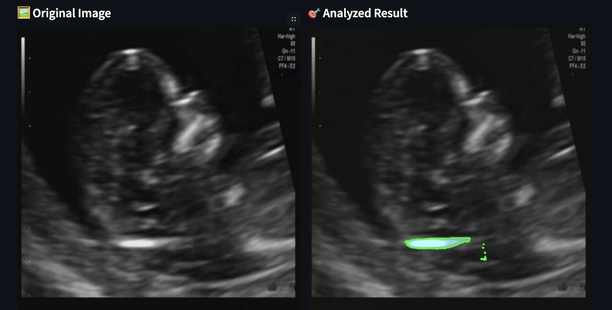

# 🩺 EarlyNT — AI-Powered Nuchal Translucency Measurement for Early Detection

**EarlyNT** is a deep learning–based tool designed to assist in the **early detection of chromosomal abnormalities** by automatically **segmenting and measuring Nuchal Translucency (NT)** thickness from first-trimester ultrasound images.

---

## 📌 Features
- 🧠 **Deep Learning Segmentation** — Automatically detects and segments the NT region  
- 📏 **Accurate Measurement** — Calculates NT thickness in millimeters  
- 📈 **Early Detection Aid** — Supports early screening for chromosomal anomalies such as Down syndrome  
- 💻 **Easy Integration** — Can be used as a script, API, or integrated into clinical research tools  

---

## 🖼️ Example Workflow
1. Upload first-trimester ultrasound image  
2. Model segments the NT region  
3. NT thickness is measured and reported in mm  
4. Results can be exported for clinical review

  
*Screenshot showing the results.*
---

## ⚙️ Tech Stack
- **Python**  
- **TensorFlow** 
- **OpenCV**  
- **Ultralytics YOLO + SAM** 

---

## Installation

1. Clone the repository:

```bash
git clone https://github.com/yourusername/eye-disease-classifier.git
cd eye-disease-classifier
```

2. Install required packages:

```bash
pip install -r requirements.txt
```

3. Run the Streamlit app:

```bash
streamlit run app.py
```